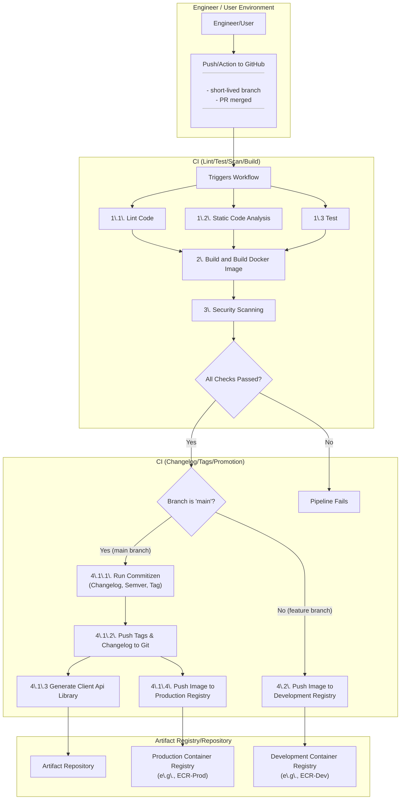
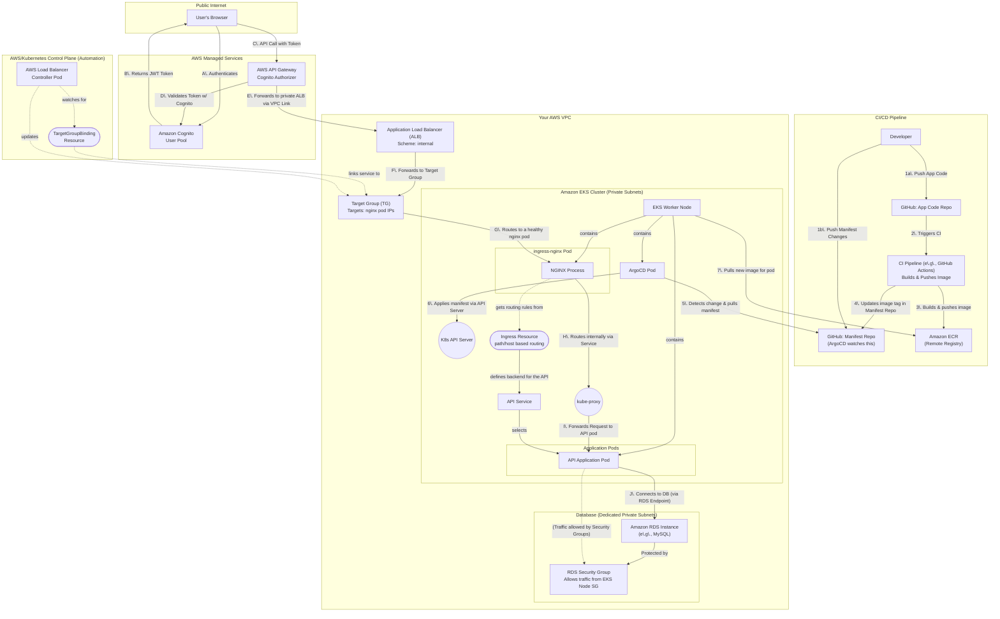

# Diagram

## CI / CD (Service)

```mermaid
graph TD
    subgraph "Engineer / User Environment"
        A[Engineer/User] --> B["Push/Action to GitHub <hr/><br/> - short-lived branch<br/>- PR merged <hr /><br/>"];
    end

    B --> step["Triggers Workflow"]
    subgraph "CI (Lint/Test/Scan/Build)"    
        step --> lint[1\.1\. Lint Code];        
        step --> static[1\.2\. Static Code Analysis];
        step --> test[1\.3 Test];
        
        lint --> buildAndDocker[2\. Build and Build Docker Image];
        static --> buildAndDocker
        test --> buildAndDocker
        buildAndDocker --> sec[3\. Security Scanning];        
        sec --> checkPassed{All Checks Passed?};
    end

    subgraph "CI (Changelog/Tags/Promotion)"
        checkPassed -- "Yes" --> H{Branch is 'main'?};
        checkPassed -- "No" --> error[Pipeline Fails];
        H -- "Yes (main branch)" --> J["4\.1\.1\. Run Commitizen<br/>(Changelog, Semver, Tag)"];

        J --> J_Push["4\.1\.2\. Push Tags & Changelog to Git"];
        J_Push --> K_GenerateClientAPI["4\.1\.3 Generate Client Api Library"]        
        J_Push --> K[4\.1\.4\. Push Image to<br/>Production Registry];
        H -- "No (feature branch)" --> L[4\.2\. Push Image to<br/>Development Registry];
    end

    subgraph "Artifact Registry/Repository"
        ProdRegistry["Production Container Registry<br/>(e\.g\., ECR-Prod)"];
        DevRegistry["Development Container Registry<br/>(e\.g\., ECR-Dev)"];
        ArtifactRepository["Artifact Repository"]
    end

    K --> ProdRegistry;
    L --> DevRegistry;
    K_GenerateClientAPI --> ArtifactRepository
```

## Full Diagram

```mermaid
graph TD
    subgraph "CI/CD Pipeline"
        Developer["Developer"]
        AppRepo["GitHub: App Code Repo"]
        ManifestRepo["GitHub: Manifest Repo<br/>(ArgoCD watches this)"]
        CI_Pipeline["CI Pipeline (e\.g\., GitHub Actions)<br/>Builds & Pushes Image"]
        ECR["Amazon ECR<br/>(Remote Registry)"]
    end

    subgraph "Public Internet"
        User["User's Browser"]
    end

    subgraph "AWS Managed Services"
        Cognito["Amazon Cognito<br/>User Pool"]
        APIGW["AWS API Gateway<br/>Cognito Authorizer"]
    end

    subgraph "Your AWS VPC"
        %% The ALB is now internal, receiving traffic only from API Gateway
        ALB["Application Load Balancer (ALB)<br/>Scheme: internal"]
        TG["Target Group (TG)<br/>Targets: nginx pod IPs"]

        subgraph "Amazon EKS Cluster (Private Subnets)"
            Node["EKS Worker Node"]
            ArgoCD["ArgoCD Pod"]
            KubeAPIServer((K8s API Server))
            
            subgraph "ingress-nginx Pod"
              Nginx["NGINX Process"]
            end

            subgraph "Application Pods"              
              APIApp["API Application Pod"]
            end
            
            KubeProxy((kube-proxy))
            IngressRes(["Ingress Resource<br/>path/host based routing"])
            APISvc["API Service"]

            Node -- contains --> Nginx            
            Node -- contains --> APIApp
            Node -- contains --> ArgoCD
        end

        subgraph "Database (Dedicated Private Subnets)"
            RDS["Amazon RDS Instance<br/>(e\.g\., MySQL)"]
            RDSSG["RDS Security Group<br/>Allows traffic from EKS Node SG"]
            RDS -- "Protected by" --> RDSSG
        end
    end

    subgraph "AWS/Kubernetes Control Plane (Automation)"
        LBC["AWS Load Balancer<br/>Controller Pod"]
        TGBRes(["TargetGroupBinding<br/>Resource"])
    end

    %% --- CI/CD Flow ---
    Developer -- "1a\. Push App Code" --> AppRepo
    AppRepo -- "2\. Triggers CI" --> CI_Pipeline
    CI_Pipeline -- "3\. Builds & pushes image" --> ECR
    CI_Pipeline -- "4\. Updates image tag in Manifest Repo" --> ManifestRepo
    Developer -- "1b\. Push Manifest Changes" --> ManifestRepo
    ArgoCD -- "5\. Detects change & pulls manifest" --> ManifestRepo
    ArgoCD -- "6\. Applies manifest via API Server" --> KubeAPIServer
    Node -- "7\. Pulls new image for pod" --> ECR

    %% --- Authentication & User Traffic Flow ---
    User -- "A\. Authenticates" --> Cognito
    Cognito -- "B\. Returns JWT Token" --> User
    User -- "C\. API Call with Token" --> APIGW
    APIGW -- "D\. Validates Token w/ Cognito" --> Cognito
    APIGW -- "E\. Forwards to private ALB via VPC Link" --> ALB
    ALB -- "F\. Forwards to Target Group" --> TG
    TG -- "G\. Routes to a healthy nginx pod" --> Nginx
    Nginx -- "H\. Routes internally via Service" --> KubeProxy    
    KubeProxy -- "I\. Forwards Request to API pod" --> APIApp
    APIApp -- "J\. Connects to DB (via RDS Endpoint)" --> RDS

    %% --- Kubernetes Control Plane Logic ---
    LBC -. " watches for " .-> TGBRes
    TGBRes -. " links service to " .-> TG
    LBC -. " updates " .-> TG
    Nginx -. " gets routing rules from " .-> IngressRes
    IngressRes -- " defines backend for the API" --> APISvc
    APISvc -- " selects " --> APIApp

    %% --- Security Note ---
    APIApp -. " (Traffic allowed by Security Groups) " .-> RDSSG

```
